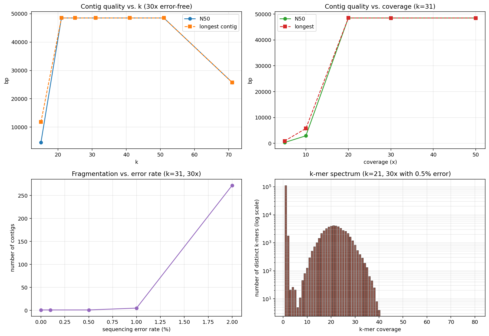

# debruijn

A from scratch library of de Bruijn graph genome assembly algorithms. The library builds the full pipeline from k-mer counting through graph construction, error correction by tip removal and low coverage edge filtering, Hierholzer Eulerian path reconstruction, and maximal non branching path contig extraction with N50 reporting. Every algorithm is validated against brute force construction on small sequences and against a full end to end assembly of the 48502 bp lambda phage reference genome at various coverage depths, k values, and error rates.

**Tests:** 15 passing in <1 s. **License:** MIT.



## Foundations

The assembly problem takes millions of short overlapping reads from shotgun sequencing and reconstructs the original genome. Two algorithmic paradigms compete. The overlap layout consensus approach treats each read as a node and each pairwise overlap as an edge, reducing assembly to Hamiltonian path which is NP hard in general and intractable at short read volumes. The de Bruijn graph approach, introduced for assembly by Idury and Waterman 1995 and crystallized in Pevzner Tang and Waterman 2001, treats each k-mer as an edge from its k minus one prefix to its k minus one suffix, reducing assembly to Eulerian path which Hierholzer 1873 solves in linear time. Compeau Pevzner and Tesler 2011 put it bluntly in their Nature Biotechnology primer: the computational problem of fragment assembly with a million reads is easier to solve than the sequencing by hybridization problem with a few thousand probes. Every modern short read assembler from Velvet 2008 through SPAdes 2012 to current long read extensions uses a de Bruijn graph at its core.

## Core algorithms

The library implements the full Velvet 2008 pipeline in simplified form. K-mer enumeration and canonical encoding are in `utils.py`, with reverse complement, canonical k-mer selection (lexicographic minimum of k-mer and its reverse complement), and FASTA and FASTQ I/O without any BioPython dependency. Exact k-mer counting is in `counting.py` via a Python Counter, with a `kmer_histogram` function for choosing a coverage cutoff by inspecting the first valley between the sequencing error spike at count one and the genomic peak near the expected coverage. A count min sketch class in the same module demonstrates the classical space accuracy tradeoff for approximate counting at genomic scale. De Bruijn graph construction lives in `graph.py` with the directed multigraph stored as dictionaries mapping each node to its neighbors and their edge weights (k-mer multiplicities). Graph cleanup is in the same module with three operations: `remove_low_coverage_edges` for spurious edge filtering, `remove_tips` for dead end branch pruning using the Velvet 2k length criterion with strict inequality, and `pop_bubbles` for parallel path resolution under a coverage ratio threshold. Eulerian path reconstruction is in `eulerian.py` as the stack based iterative Hierholzer algorithm, with proper detection of the unbalanced start and end nodes using total edge multiplicity rather than distinct neighbor count (a subtle bug that the multi edge case exposes). Contig extraction by maximal non branching path decomposition is in `contigs.py`, with N50 and assembly statistics. Read simulation for pipeline validation is in `simulate.py` with configurable read length, coverage depth, and substitution error rate.

## End to end validation on lambda phage

The demo assembles the 48502 bp lambda phage reference (NCBI NC_001416.1) at a sweep of coverage depths, k values, and error rates. At k equals 31 and 20x error free coverage the pipeline recovers a single 48473 bp contig, 99.9 percent of the reference length. A k sweep at 30x error free coverage shows the classical unimodal relationship: k equals 15 fragments into 20 contigs due to repeat collapse, k from 21 through 51 all produce a single near complete contig, and k equals 71 fragments again because the overlap between reads becomes too short at that k. A coverage sweep at k equals 31 shows the Lander Waterman threshold: at 5x coverage the assembly produces 245 short contigs with N50 equal to 319 bp, at 10x it produces 28 contigs with N50 equal to 2903 bp, and at 20x and higher it resolves into a single contig near the full reference length. An error rate sweep at 30x and k equals 31 confirms that error free reads recover one contig of length 48484 bp, 0.1 percent error still recovers a single contig, 0.5 percent still recovers a single contig, 1 percent fragments into 5 contigs with N50 around 31 kb, and 2 percent fragments badly into 272 contigs with N50 around 423 bp. The k-mer spectrum at k equals 21 with 0.5 percent error shows the textbook shape: a tall spike at coverage one of 111592 distinct k-mers (all sequencing error artifacts) and a rising density toward the genomic peak at the expected 30x.

## Layout

```
literature/   foundational papers (Pevzner Tang Waterman 2001, Zerbino Birney 2008 Velvet, Compeau Pevzner Tesler 2011 Nature Biotech primer)
data/         real genome data (lambda phage reference NC_001416.1, 48502 bp)
docs/         lit_review.md (literature synthesis) and PLAN.md (layered roadmap)
src/debruijn/ the library (utilities, k-mer counting with count min sketch, de Bruijn graph with tip and bubble cleanup, Eulerian path, contig extraction, read simulation, visualization)
tests/        pytest suite (fifteen tests covering reverse complement involution, canonical k-mer selection, k-mer enumeration, exact and canonical k-mer counting, count min sketch overestimation, de Bruijn graph construction and N skipping, Eulerian path recovery on a repeated reference, Eulerian reconstruction on simulated reads, tip removal branch point detection, linear contig extraction, N50 computation on known contigs, assembly statistics fields, and end to end simulated assembly)
results/      figures and benchmark output
```

## Quick start

```bash
cd src
python3 -m debruijn.demo
```

The demo walks through a single error free simulation at 20x coverage, a k sweep from 15 to 71 at 30x coverage, a coverage sweep from 5x to 50x at k equals 31, an error rate sweep from zero to 2 percent at k equals 31 and 30x, a k-mer spectrum visualization at k equals 21 with 0.5 percent error, and a full Eulerian path reconstruction on a 2 kb substring at k equals 25. Output figures for N50 versus k, N50 versus coverage, contig count versus error rate, and the k-mer coverage histogram are written to `results/debruijn_demo.png`.

## Testing

```bash
python3 -m pytest tests/ -q
```

Fifteen tests, all passing. Coverage includes reverse complement involution, canonical k-mer selection (lexicographic minimum rule), k-mer enumeration with N skipping, exact k-mer counting with and without canonicalization (the reverse complement merge), count min sketch over-estimation on added and never added items, de Bruijn graph edge count with multiplicity, N skipping at graph construction, Eulerian path recovery on a reference with repeated k-mers (the canonical ACGTACGTACGTACGT test case that requires correctly identifying the unbalanced start node using total edge multiplicity), Eulerian reconstruction on simulated reads with k-mer set preservation, tip removal with branch point detection and strict length inequality, linear contig extraction and sequence length arithmetic, N50 computation on a known contig set, assembly statistics fields, and a full end to end simulated assembly recovering at least 50 percent of a 150 bp reference at 40x coverage and k equals 25.

## Dependencies

The core library requires only `numpy`. Plotting needs `matplotlib`. Install with

```bash
pip install numpy matplotlib pytest
```

## References

The literature review in `docs/lit_review.md` synthesizes Idury and Waterman 1995 (the original de Bruijn graph assembly formulation), Pevzner Tang and Waterman 2001 (the EULER algorithm, the Eulerian superpath problem for repeats, and the spectral error correction approach), Zerbino and Birney 2008 (the Velvet assembler with its three error type taxonomy of tips, bulges, and erroneous connections, the 2k tip length criterion, the Tour Bus bubble popper, and the twin node convention for double stranded DNA), Compeau Pevzner and Tesler 2011 (the Nature Biotechnology primer that explains why Eulerian beats Hamiltonian and enumerates the four hidden assumptions about next generation sequencing), Chikhi and Medvedev 2014 (principled k selection from the k-mer spectrum), Marcais and Kingsford 2011 (Jellyfish at genomic k-mer counting scale), and Bankevich et al 2012 (SPAdes as the modern reference implementation). The first three papers are included as PDFs in the `literature/` folder and were read in full for this project.
